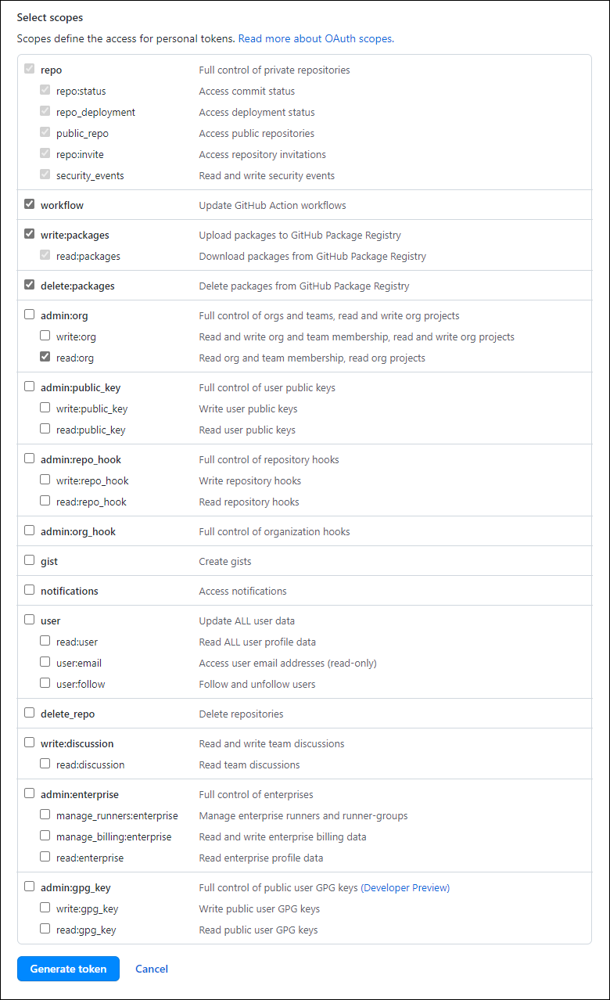

# Global Azure 2023 - Workshop

Public repo: <https://github.com/RogalaPiotr/global-azure-2023>

# Prerequisites

1. Visual Studio Code (extension's like: Azure, Git, Docker)
    1. Azure PowerShell / Azure CLI
2. GitHub (account + repo)
    1. GitHub PAT: [https://github.com/microsoft/MCW-Continuous-delivery-in-Azure-DevOps/blob/master/Hands-on%20lab/Before%20the%20HOL%20-%20Continuous%20delivery%20in%20Azure%20DevOps.md](https://github.com/microsoft/MCW-Continuous-delivery-in-Azure-DevOps/blob/master/Hands-on%20lab/Before%20the%20HOL%20-%20Continuous%20delivery%20in%20Azure%20DevOps.md)
3. Docker
4. Azure DevOps - project
5. Azure Subscription with credits for use

# Workshop

## Phase 1

Clone / Fork / download files, repo: <https://github.com/RogalaPiotr/global-azure-2023> to your repository.

## Phase 2

Open directory in VSC and run commands to test app in docker.

Replace instances of `<yourgithubaccount>` with your GitHub account name in the following files located in the root of your lab files repository.

- `docker-compose.init.yml`
- `docker-compose.yml`

Build and run the docker-compose YAML files edited in the previous step.

`docker-compose -f .\docker-compose.yml -f .\local.docker-compose.yml -f .\docker-compose.init.yml build
docker-compose -f .\docker-compose.yml -f .\local.docker-compose.yml -f .\docker-compose.init.yml up`

Verify that you can browse to [http://localhost:3000](http://localhost:3000/) in browser.

If everything works - commit changes to your GitHub repository.

## Phase 3

Create PAT in GitHub

Instruction: [https://docs.github.com/en/authentication/keeping-your-account-and-data-secure/creating-a-personal-access-token](https://docs.github.com/en/authentication/keeping-your-account-and-data-secure/creating-a-personal-access-token)

1. <https://github.com/settings/tokens> - create here

- `repo` - Full control of private repositories.
- `workflow` - Update GitHub Action workflows.
- `write:packages` - Upload packages to GitHub Package Registry.
- `delete:packages` - Delete packages from GitHub Package Registry.
- `read:org` - Read org and team membership, read org projects. This is under the `admin:org` section of scopes.



## Phase 4

1. In your GitHub lab files repository, select the `Settings` tab.
2. Select the `Secrets` blade from the left navigation bar.

    

3. Select the `New repository secret` button.

    

4. Enter the name `CR_PAT` in the `New secret` form and set the GitHub Personal Access Token we created in the Before the Hands-On Lab instructions.

    

    > Note: CR_PAT is short for Container Registry Personal Authentication Token.
    >
5. Select the `Actions` tab in your GitHub repository, find the `Publish Docker Container` workflow and select `Configure`. This will create a file named `docker-publish.yml`.

    

6. Rename file named `1-docker-publish.yml`. to `docker-publish-1.yml`
7. Paste there this code:

    ```powershell
    name: docker-publish-1
    
    # This workflow uses actions that are not certified by GitHub.
    # They are provided by a third-party and are governed by
    # separate terms of service, privacy policy, and support
    # documentation.
    
    on:
      #push:
      #  branches: [ main ]
      #  # Publish semver tags as releases.
      #  tags: [ 'v*.*.*' ]
      #pull_request:
      #  branches: [ main ]
      workflow_dispatch:
    
    env:
      # Use docker.io for Docker Hub if empty.
      REGISTRY: ghcr.io/${{ github.actor }}
      # github.repository as <account>/<repo>
      API_IMAGE_NAME: fabrikam-api
      INIT_IMAGE_NAME: fabrikam-init  
      WEB_IMAGE_NAME: fabrikam-web
    
    jobs:
      check_changed_folders:
          name: Check modified files
          outputs:
            run_api_job: ${{ steps.check_files.outputs.run_api_job }}
            run_web_job: ${{ steps.check_files.outputs.run_web_job }}
            run_init_job: ${{ steps.check_files.outputs.run_init_job }}
          runs-on: ubuntu-latest
          steps:
            - name: Checkout code
              uses: actions/checkout@v2
              with:
                fetch-depth: 2
    
            - name: check modified files
              id: check_files
              run: |            
                echo "========== check paths of modified files =========="
                git diff --name-only HEAD^ HEAD > files.txt
                echo "::set-output name=run_api_job::false"                
                echo "::set-output name=run_web_job::false"            
                echo "::set-output name=run_init_job::false"
                while IFS= read -r file
                do
                  echo $file
                  if [[ $file == content-api/* ]]; then                
                    echo "::set-output name=run_api_job::true"
                    continue
                  elif [[ $file == content-web/* ]]; then                                                  
                    echo "::set-output name=run_web_job::true"
                    continue
                  elif [[ $file == content-init/* ]]; then                
                    echo "::set-output name=run_init_job::true"
                    continue
                  fi
                done < files.txt
      build-api:
        runs-on: ubuntu-latest
        name: Update the API Docker image
        needs: check_changed_folders
        if: needs.check_changed_folders.outputs.run_api_job == 'true'
        permissions:
          contents: read
          packages: write
          # This is used to complete the identity challenge
          # with sigstore/fulcio when running outside of PRs.
          id-token: write
    
        steps:
          - name: Checkout repository
            uses: actions/checkout@v3
    
          # Workaround: https://github.com/docker/build-push-action/issues/461
          - name: Setup Docker buildx
            uses: docker/setup-buildx-action@79abd3f86f79a9d68a23c75a09a9a85889262adf
    
          # Login against a Docker registry except on PR
          # https://github.com/docker/login-action
          - name: Log into registry ${{ env.REGISTRY }}
            if: github.event_name != 'pull_request'
            uses: docker/login-action@28218f9b04b4f3f62068d7b6ce6ca5b26e35336c
            with:
              registry: ${{ env.REGISTRY }}
              username: ${{ github.actor }}
              password: ${{ secrets.CR_PAT }}
    
          # Extract API image metadata (tags, labels) for Docker
          # https://github.com/docker/metadata-action
          - name: Extract Docker metadata for ${{ env.API_IMAGE_NAME }}
            id: meta
            uses: docker/metadata-action@98669ae865ea3cffbcbaa878cf57c20bbf1c6c38
            with:
              images: ${{ env.REGISTRY }}/${{ env.API_IMAGE_NAME }}
    
          # Build and push Docker image with Buildx (don't push on PR)
          # https://github.com/docker/build-push-action
          - name: Build and push Docker image for ${{ env.API_IMAGE_NAME }}
            id: build-and-push
            uses: docker/build-push-action@ad44023a93711e3deb337508980b4b5e9bcdc5dc
            with:
              file: ./content-api/Dockerfile                      # <-- Add these
              context: ./content-api                              # <-- two lines
              push: ${{ github.event_name != 'pull_request' }}
              tags: ${{ steps.meta.outputs.tags }}
              labels: ${{ steps.meta.outputs.labels }}
    
      build-init:
        runs-on: ubuntu-latest
        name: Update the Init Docker image
        needs: check_changed_folders
        if: needs.check_changed_folders.outputs.run_init_job == 'true'
        permissions:
          contents: read
          packages: write
          # This is used to complete the identity challenge
          # with sigstore/fulcio when running outside of PRs.
          id-token: write
    
        steps:
          - name: Checkout repository
            uses: actions/checkout@v3
    
          # Workaround: https://github.com/docker/build-push-action/issues/461
          - name: Setup Docker buildx
            uses: docker/setup-buildx-action@79abd3f86f79a9d68a23c75a09a9a85889262adf
    
          # Login against a Docker registry except on PR
          # https://github.com/docker/login-action
          - name: Log into registry ${{ env.REGISTRY }}
            if: github.event_name != 'pull_request'
            uses: docker/login-action@28218f9b04b4f3f62068d7b6ce6ca5b26e35336c
            with:
              registry: ${{ env.REGISTRY }}
              username: ${{ github.actor }}
              password: ${{ secrets.CR_PAT }}      
    
          # Extract INIT image metadata (tags, labels) for Docker
          # https://github.com/docker/metadata-action
          - name: Extract Docker metadata for ${{ env.INIT_IMAGE_NAME }}
            id: meta-init
            uses: docker/metadata-action@98669ae865ea3cffbcbaa878cf57c20bbf1c6c38
            with:
              images: ${{ env.REGISTRY }}/${{ env.INIT_IMAGE_NAME }}
    
          # Build and push Docker image with Buildx (don't push on PR)
          # https://github.com/docker/build-push-action
          - name: Build and push Docker image for ${{ env.INIT_IMAGE_NAME }}
            id: build-and-push-init
            uses: docker/build-push-action@ad44023a93711e3deb337508980b4b5e9bcdc5dc
            with:
              file: ./content-init/Dockerfile                      # <-- Add these
              context: ./content-init                              # <-- two lines
              push: ${{ github.event_name != 'pull_request' }}
              tags: ${{ steps.meta-init.outputs.tags }}
              labels: ${{ steps.meta-init.outputs.labels }}
    
      build-web:
        runs-on: ubuntu-latest
        name: Update the Web Docker image
        needs: check_changed_folders
        if: needs.check_changed_folders.outputs.run_web_job == 'true'
        permissions:
          contents: read
          packages: write
          # This is used to complete the identity challenge
          # with sigstore/fulcio when running outside of PRs.
          id-token: write
    
        steps:
          - name: Checkout repository
            uses: actions/checkout@v3
    
          # Workaround: https://github.com/docker/build-push-action/issues/461
          - name: Setup Docker buildx
            uses: docker/setup-buildx-action@79abd3f86f79a9d68a23c75a09a9a85889262adf
    
          # Login against a Docker registry except on PR
          # https://github.com/docker/login-action
          - name: Log into registry ${{ env.REGISTRY }}
            if: github.event_name != 'pull_request'
            uses: docker/login-action@28218f9b04b4f3f62068d7b6ce6ca5b26e35336c
            with:
              registry: ${{ env.REGISTRY }}
              username: ${{ github.actor }}
              password: ${{ secrets.CR_PAT }}
    
          # Extract WEB image metadata (tags, labels) for Docker
          # https://github.com/docker/metadata-action
          - name: Extract Docker metadata for ${{ env.WEB_IMAGE_NAME }}
            id: meta-web
            uses: docker/metadata-action@98669ae865ea3cffbcbaa878cf57c20bbf1c6c38
            with:
              images: ${{ env.REGISTRY }}/${{ env.WEB_IMAGE_NAME }}
    
          # Build and push Docker image with Buildx (don't push on PR)
          # https://github.com/docker/build-push-action
          - name: Build and push Docker image for ${{ env.WEB_IMAGE_NAME }}
            id: build-and-push-web
            uses: docker/build-push-action@ad44023a93711e3deb337508980b4b5e9bcdc5dc
            with:
              file: ./content-web/Dockerfile                      # <-- Add these
              context: ./content-web                              # <-- two lines
              push: ${{ github.event_name != 'pull_request' }}
              tags: ${{ steps.meta-web.outputs.tags }}
              labels: ${{ steps.meta-web.outputs.labels }}
    ```

8. Save and check in actions if it’s running.
9. Add changes like comment `#Test` to files:
    1. In the `content-web` folder, add a comment to the top of `Dockerfile`
    2. In the `content-api` folder, add a comment to the top of `Dockerfile`
    3. In the `content-init` folder, add a comment to the top of `Dockerfile`
10. Save and commit to repository.
11. Check packages in GitHub
    1. URL example: [https://github.com/RogalaPiotr?tab=packages](https://github.com/RogalaPiotr?tab=packages)

    

## Phase 5

Using Dependabot in GitHub - In your lab files GitHub repository, navigate to the `Security` tab. Select the `Enable Dependabot alerts` button.


You should arrive at the `Security & analysis` blade under the `Settings` tab. Enable `Dependabot security updates`.


To observe Dependabot issues, navigate to the `Security` tab and select the `View Dependabot alerts` link. You should arrive at the `Dependabot alerts` blade in the `Security` tab.


Sort the Dependabot alerts by `Package name`. Locate the `handlebars` vulnerability by typing `handlebars` in the search box under the `Package` dropdown menu.


Select any of the `handlebars` Dependabot alert entries to see the alert detail. After reviewing the alert, select `Create Dependabot security update` and wait a few moments for GitHub to create the security update.


In the `Pull Requests` tab, find the Dependabot security patch pull request and merge it to your main branch.


Pull the latest changes from your GitHub repository to your local GitHub folder.

## Phase 6

Deployment Azure Infrastructure

Open the `1-deploy-infrastructure.ps1` and edit names before run script.


In terminal login to Azure

```
az login
az account set --subscription <your subscription guid>
```

Run script  `1-deploy-infrastructure.ps1`

Browse to [the Azure portal](https://portal.azure.com/) and verify creation of the resource group, Azure Cosmos DB instance, the App Service Plan, and the Web App.


Open the `2-seed-cosmosdb.ps1`and edit names before run script.


This command require put PAT in terminal

```powershell
# login to gh + PAT as a Password
docker login ghcr.io -u $githubAccount
```

Run script  `2-seed-cosmosdb.ps1`

Browse to [the Azure portal](https://portal.azure.com/) and verify that the Azure Cosmos DB instance has been seeded.


Below the `sessions` collection, select **Scale & Settings** (1) and **Indexing Policy** (2).


Create a Single Field indexing policy for the `startTime` field (1). Then, select **Save** (2).


Open the `3-configure-webapp.ps1`and edit names before run script.


Run script  `3-configure-webapp.ps1`. Browse to [the Azure portal](https://portal.azure.com/) and verify that the environment variable `MONGODB_CONNECTION` has been added to the Azure Web Application settings.


Open the `4-deploy-webapp.ps1`and edit names before run script.


Before run in terminal run command:

```powershell
$env:CR_PAT="<GitHub Personal Access Token>"
```

and verify your path if you are in right place ./infrastructure folder.

If you are there you can run the script `4-deploy-webapp.ps1`

Browse to [the Azure portal](https://portal.azure.com/) and verify that the Azure Web Application is running by checking the `Log stream` blade of the Azure Web Application detail page.


Browse to the `Overview` blade of the Azure Web Application detail page and find the web application URL. Browse to that URL to verify the deployment of the web application.


## Phase 7

Open the `5-deploy-sp.ps1`and edit names before run script.


Run script `5-deploy-sp.ps1` and copy whole output

```powershell
{
    "clientId": "...",
    "clientSecret": "...",
    "subscriptionId": "...",
    "tenantId": "...",
    "activeDirectoryEndpointUrl": "https://login.microsoftonline.com",
    "resourceManagerEndpointUrl": "https://management.azure.com/",
    "activeDirectoryGraphResourceId": "https://graph.windows.net/",
    "sqlManagementEndpointUrl": "https://management.core.windows.net:8443/",
    "galleryEndpointUrl": "https://gallery.azure.com/",
    "managementEndpointUrl": "https://management.core.windows.net/"
}
```

After then, create a new repository secret named `AZURE_CREDENTIALS`. Paste the JSON output copied from previous step to the secret value and save it.

Example URL: [https://github.com/RogalaPiotr/global-azure-2023/settings/secrets/actions](https://github.com/RogalaPiotr/global-azure-2023/settings/secrets/actions)

In next step, rename file named `2-docker-publish.yml`. to `docker-publish-2.yml` and move to ./github/workflow

Please check differences with firs file. There is added section:

```powershell
deploy:
    # The type of runner that the job will run on
    runs-on: ubuntu-latest

    # Steps represent a sequence of tasks that will be executed as part of the job
    steps:
    # Checks-out your repository under $GITHUB_WORKSPACE, so your job can access it
    - uses: actions/checkout@v2                

    - name: Login on Azure CLI
      uses: azure/login@v1.1
      with:
        creds: ${{ secrets.AZURE_CREDENTIALS }}

    - name: Deploy WebApp
      shell: pwsh
      env:
        CR_PAT: ${{ secrets.CR_PAT }}
      run: |
        cd ./infrastructure
        ./4-deploy-webapp.ps1 -studentprefix XXX  # <-- This needs to
                                                # match the student
                                                # prefix we use in
                                                # previous steps.
```

Commit changes and run in GitHub Actions - `docker-publish-2`

Effect:


## Phase 8

Open clean/new Azure DevOps project.

Navigate to your Azure DevOps project, select the `Project Settings` blade, and open the `Service Connections` tab.

Create a new `Docker Registry` service connection and set the values to:

- Docker Registry: [https://ghcr.io](https://ghcr.io/)
- Docker ID: [GitHub account name]
- Docker Password: [GitHub Personal Access Token]
- Service connection name: GitHub Container Registry


Navigate to your Azure DevOps  project, select the `Pipelines` blade, and create a new pipeline.


In the `Connect` tab, choose the `GitHub` selection.


Probably you should authorise GitHub in Azure DevOps… there will be few steps more with “next, next”

Select your GitHub lab files repository. Azure DevOps will redirect you to authorise yourself with GitHub. Log in and select the repository that you want to allow Azure DevOps to access.

In the `Configure` tab, choose the `Starter Pipeline`.


Remove all in the file:

```powershell
# Starter pipeline
# Start with a minimal pipeline that you can customize to build and deploy your code.
# Add steps that build, run tests, deploy, and more:
# https://aka.ms/yaml

trigger:
- main

pool:
  vmImage: ubuntu-latest

steps:
```

And paste this:

```powershell
# Starter pipeline
# Start with a minimal pipeline that you can customize to build and deploy your code.
# Add steps that build, run tests, deploy, and more:
# https://aka.ms/yaml

trigger:
- main

pool:
  vmImage: ubuntu-latest

stages:
- stage: build
  jobs:
  - job: 'BuildAndPublish'
    displayName: 'Build and Publish'
    steps:
    - task: DockerCompose@0
      inputs:
        containerregistrytype: 'Container Registry'
        dockerRegistryEndpoint: 'GitHub Container Registry'
        dockerComposeFile: '**/docker-compose.yml'
        additionalDockerComposeFiles: 'build.docker-compose.yml'
        action: 'Build services'
        additionalImageTags: '$(Build.BuildNumber)'
    - task: DockerCompose@0
      inputs:
        containerregistrytype: 'Container Registry'
        dockerRegistryEndpoint: 'GitHub Container Registry'
        dockerComposeFile: '**/docker-compose.yml'
        additionalDockerComposeFiles: 'build.docker-compose.yml'
        action: 'Push services'
        additionalImageTags: '$(Build.BuildNumber)'
```

Save and trigger pipeline.

Effect:


Before setup deployment we have to add `CR_PAT` in ADO

Navigate to your project in Azure DevOps and select the `Project Settings` blade. From there, select the `Service Connections` tab.

Choose your target subscription and resource group and set the `Service Connection` name to `Fabrikam-Azure`. Save the service connection - we will reference it in a later step.

Bach to pipeline, and click edit. In Variable add new one `CR_PAT`.


In YAML file add section for deployment:

```
- stage: DeployProd
  dependsOn: build
  jobs:
  - deployment: webapp
    environment: production
    strategy:
      runOnce:
        deploy:
          steps:
          - checkout: self

          - powershell: |
              (gc .\docker-compose.yml) `
                -replace ':latest',':$(Build.BuildNumber)' | `
                set-content .\docker-compose.yml
                
          - task: AzureCLI@2
            inputs:
              azureSubscription: 'Fabrikam-Azure' # <-- The service
              scriptType: 'pscore'                # connection from step 14
              scriptLocation: 'scriptPath'
              scriptPath: './infrastructure/4-deploy-webapp.ps1'
              workingDirectory: ./infrastructure
              arguments: 'XXX'         # <-- This should be your custom
            env:                       # lowercase three character 
              CR_PAT: $(CR_PAT)
```

To ensure a smooth pipeline run, make sure to first access the Environment settings and add a production step with self-approval check. This will help streamline the process and ensure maximum efficiency. Like on the screens.


After then, back to Pipelines and run.

END WORKSHOP!

Thank you!